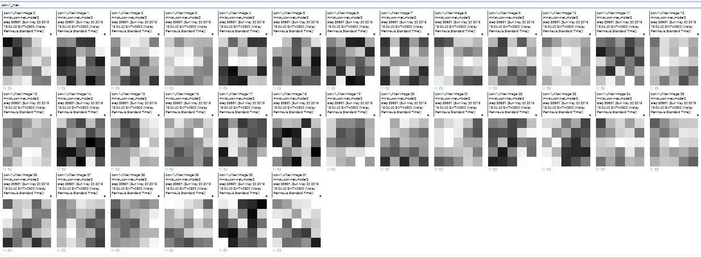
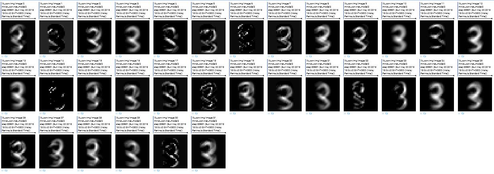
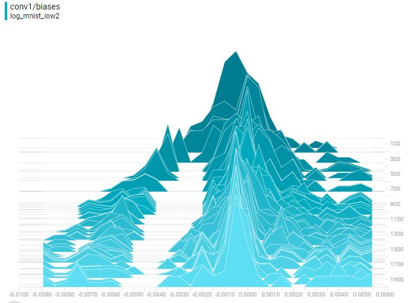
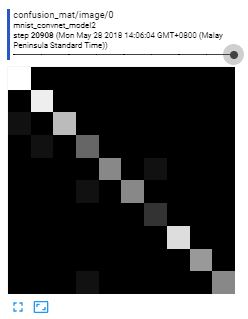
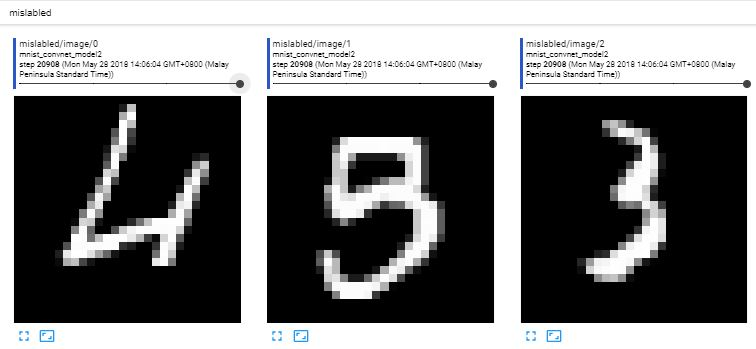
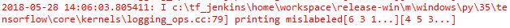

# Classifying the MNIST dataset with CNNs
## Demonstrating different methods of implementing Convolutional Neural Networks (CNN) using tensorflow.
Two methods of implementing CNNs in tensorflow are used: Using custom estimators, and building from the low level API.
The CNN example using custom estimators are in cnn_minst.py, and the low level API is built in cnn_minst_low_level.py. The MNIST dataset is used, and the custom estimators are adapted from the [tensorflow tutorial](https://www.tensorflow.org/tutorials/layers). Changes are made so that the model can be monitored in tensorboard. The low level API implementation is adapted from [the tensorboard demo](https://gist.github.com/decentralion/4f02ab8f1451e276fea1f165a20336f1#file-mnist-py). Once again, changes are made to output things I found interesting.
## Sample tensorboard outputs
### Trained convolution filter weights

### Image after applying weights

### Histogram of filter bias

### Confusion matrix
The columns are the predicted values, and rows are the labels

### Print mislabeled image
Very rudimentary printing of mislabeld image in tensorboard along with printing the predicted vs label in the python console.
This indicates that for the 3 images printed, the model predicted 6, 3, 1, but the label was 4, 5, 3

## Progress
- [x] Implement algorithm
- [x] Insert Tensorboard hooks
- [x] Output graph
= [x] Show accuracy progress
- [x] Show convolution weights
- [x] Show convolution outputs
- [x] Show confusion matrix
- [x] Print misclassified images
